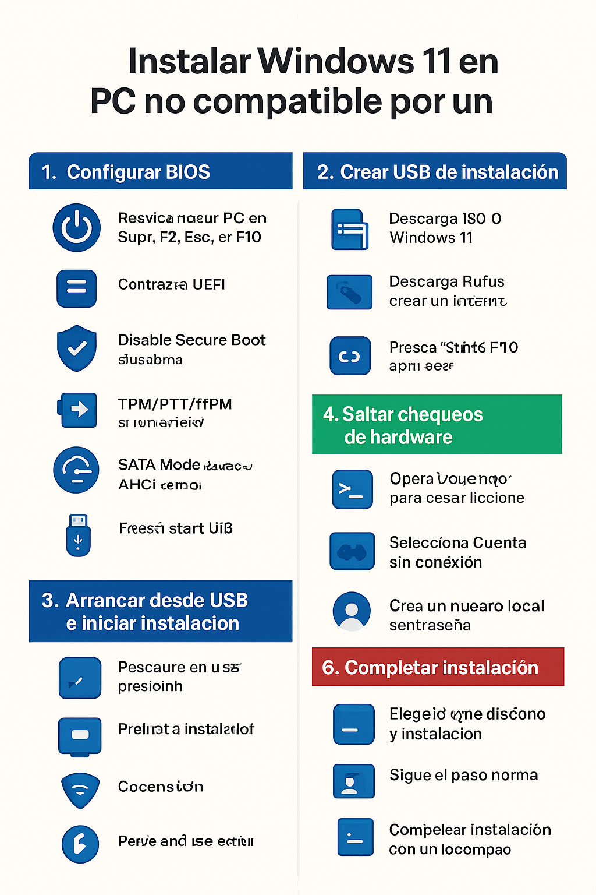

# Instalación Windows 11
Notas sobre la instalación o actualización a Windows 11 en equipos no compatibles según Microsoft.

## **🖥️ 1. Configurar BIOS**
| Paso | Acción          | Detalles                                                          |
| ---- | --------------- | ----------------------------------------------------------------- |
| 1    | Entrar a BIOS   | Reinicia PC → presiona `Supr`, `F2`, `Esc` o `F10` según tu placa |
| 2    | Boot Mode       | Cambia a **UEFI**                                                 |
| 3    | Secure Boot     | **Disabled** si tu PC no lo soporta                               |
| 4    | TPM/PTT/fTPM    | **Enable** si está disponible (si no, no pasa nada)               |
| 5    | SATA Mode       | Cambia a **AHCI** (opcional, para SSD/HDD modernos)               |
| 6    | Fast Boot       | **Disabled** (opcional, ayuda a detectar USB)                     |
| 7    | Guardar y salir | Busca **Save & Exit** → reinicia PC                               |

## **💾 2. Crear USB de instalación**
| Paso | Acción           | Detalles                                               |
| ---- | ---------------- | ------------------------------------------------------ |
| 1    | Descargar ISO    | ISO oficial Windows 11 desde Microsoft                 |
| 2    | Descargar Rufus  | Para crear USB booteable                               |
| 3    | Insertar USB     | ≥8 GB                                                  |
| 4    | Configurar Rufus | Esquema → **GPT**, Sistema destino → **UEFI (no CSM)** |
| 5    | Crear USB        | Presiona **Start**                                     |

## **🚀 3. Arrancar desde USB e iniciar instalación**
| Paso | Acción             | Detalles                                           |
| ---- | ------------------ | -------------------------------------------------- |
| 1    | Arrancar desde USB | Presiona `F12`, `Esc` o tecla de arranque según PC |
| 2    | Pantalla inicial   | “Instalar ahora” aparece                           |
| 3    | Abrir CMD          | Presiona `Shift + F10`                             |

## **⚡ 4. Saltar chequeos de hardware**
En CMD escribe y presiona Enter:

```
OOBE\BYPASSNRO
```

* Esto reinicia el instalador.
* Ya no bloqueará hardware no compatible (TPM, Secure Boot, CPU, RAM).

## **🙋‍♂️ 5. Crear cuenta local sin internet**
| Paso | Acción                   | Detalles                                    |
| ---- | ------------------------ | ------------------------------------------- |
| 1    | No conectarse a internet | Desconecta Wi-Fi o cable                    |
| 2    | Seleccionar cuenta local | Aparecerá la opción **Cuenta sin conexión** |
| 3    | Crear usuario            | Ingresa nombre y contraseña local           |

## **✅ 6. Completar instalación**
* Elegir idioma, disco de instalación y seguir pasos normales.
* Windows 11 se instalará funcionando correctamente en PC no compatible.

## **⚠️ Recomendaciones finales**
* Haz **backup** de tus datos antes de instalar.
* Verifica drivers tras la instalación.
* Opcional: habilitar TPM/Bitlocker si tu PC lo soporta.

## Guia gráfica

