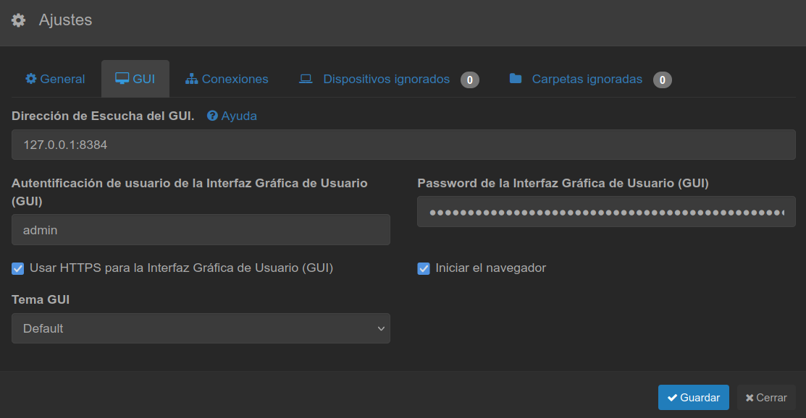

# Syncthing
Puesta en marcha de Syncthing tras la instalación: acceso web y configuración como servicio systemd.

## Prerrequisitos
- Syncthing instalado según la distribución

## ✅ 1. Arrancar y configurar Syncthing

Después de instalarlo, arranca el servicio con el icono que aparecerá en el entorno gráfico.

Si no dispones de entorno gráfico, desde un terminal:
```bash
sudo systemctl --user start syncthing@$USER.service
```

Accede a la interfaz web en [https://localhost:8384/](https://localhost:8384/).

Si no tienes entorno gráfico, edita el fichero de configuración directamente:
```
~/.config/syncthing/config.xml
```

Para dar acceso remoto, modifica la siguiente línea:
```xml
<gui enabled="true" tls="true" debugging="false">
    <address>localhost:8384</address>
```
Sustituye `localhost` por una IP accesible del host y cambia el puerto si lo deseas.




## ✅ 2. Configurar el servicio systemd

Crea o edita `/etc/systemd/system/syncthing.service`:
```
[Unit]
Description=Syncthing - Open Source Continuous File Synchronization for %I
Documentation=man:syncthing(1)
After=network.target

[Service]
User=<usuario que lo ejecutará>
ExecStart=/usr/bin/syncthing -no-browser -no-restart
Restart=on-failure
RestartSec=5

[Install]
WantedBy=default.target
```

Gestión del servicio:
```bash
# Arrancar
sudo systemctl start syncthing.service
# Estado
sudo systemctl status syncthing.service
# Parar
sudo systemctl stop syncthing.service
# Habilitar al arranque (no recomendado en portátiles)
sudo systemctl enable syncthing.service
# Deshabilitar al arranque
sudo systemctl disable syncthing.service
```
